# Microservices-Gitops
This repository contains the microservices source code, Dockerfiles, and CI pipelines. Below is the project documentation. 

Navigate to the section for this repository [here.](#application-repository)

# Ecommerce Microservices Deployment on EKS with GitOps

## Table of content
- [Overview](#overview)
- [Objectives](#objectives)
- [Technologies](#technologies)
- [Project Architecture](#project-architecture)
- [Workflow Overview](#workflow-overview)
- [Infrastructure Repository](#infrastructure-repository)
- [Application Repository](#application-repository)
- [Manifest Repository](#manifest-repository) 

## Overview
This project involves deploying 10 ecommerce microservices application to EKS using GitOps principles. The solution leverages three repositories—Infrastructure, Application, and Kubernetes Manifests—to ensure separation of concerns and effective management of critical aspect of the project. The kubernetes cluster is managed using helm charts, ArgoCD, EFK stack, and Kube Prometheus Stack.

## Objectives
1. Infrastructure Automation: Provision EKS Cluster using Terraform and Ansible.
2. Application Deployment: Build, scan, and deploy microservices as Docker containers with CI/CD pipelines.
3. GitOps Approach: Use ArgoCD for managing Kubernetes application manifests and continuous deployment.
4. Observability: Implement comprehensive logging and monitoring solutions with the EFK stack and Kube-Prometheus.

Infrastructure Tools:
- **Terraform**: Provisions the networking environment and EKS cluster.
- **Ansible**: Sets up ArgoCD, EFK Stack, and Kube Prometheus Stack on the kubernetes Cluster using helm charts.
- **EKS**: Managed Kubernetes service on AWS.

Application Tools:
- **Docker**: Containerizes microservices.
- **Trivy**: Scans Docker images for vulnerabilities.
- **GitHub Actions**: Automates CI/CD workflows.

Kubernetes Tools:
- **ArgoCD**: Manages microservices deployment with GitOps principles.
- **Helm**: Simplifies application deployment with reusable charts.
- **EFK/ELK stack**: Provides centralized logging.
- **Kube Prometheus stack**: Offers monitoring and alerting for workloads.

## Project Architecture
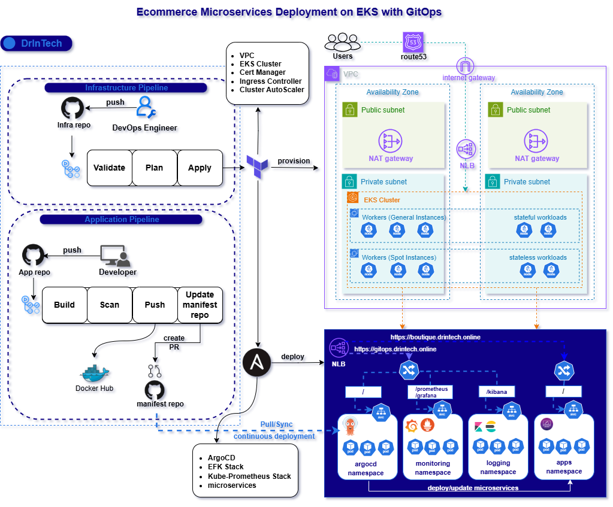

## Microservices Architecture


### Microservices Components
- **Frontend Service** (Go) - Web interface for users
- **Cart Service** (C#) - Shopping cart data management
- **Product Catalog Service** (Go) - Product information management
- **Currency Service** (Node.js) - Currency conversion
- **Payment Service** (Node.js) - Payment processing
- **Shipping Service** (Go) - Shipping cost calculation
- **Email Service** (Python) - Order confirmation emails
- **Checkout Service** (Go) - Order processing
- **Recommendation Service** (Python) - Product recommendations
- **Ad Service** (Java) - Targeted advertisements

## Workflow Overview
This project utilizes three github repositories for separation of concerns and effective management of Infrastructure, Manifests and CI workflows.
- Infrastructure repo: This includes terraform files and ansible roles for configuring and setting up the EKS cluster.
- Application repo: This includes source codes, Dockerfiles and CI pipelines for building and packaging the microservices.
- Kubernetes Manifest repo: The kubernetes manifests for the microservices applications are managed here.

### How it works (Workflow Operation)
1. Provisioning: Terraform provisions VPC, EKS cluster and trigger Ansible. Ansible deploys ArgoCD, EFK Stack, Kube Prometheus Stack and also applies the argocd manifests files.
2. Continuous Integration: Developer pushes to the app repo triggers the CI pipelines. The CI pipeline builds the latest changes, scan the docker image, push to dockerhub, update the respective manifests with the latest docker image tag and creates a PR in the Manifest repo.
3. Continuous Deployment: When the PR is merged to the main branch, ArgoCD automatically syncs the latest changes in the repo with the cluster. 

## Infrastructure Repository
This repository includes terraform and ansible configurations to set up and configure the EKS Cluster. 

### Repository Structure
```perl
microservices-infra/
├── .github/
│   └── workflows/
│       └── terraform.yml
├── ansible/
│   ├── roles/
│   │   ├── argocd/
│   │   ├── argocd_application/
│   │   ├── logging/
│   │   └── monitoring/
│   ├── ansible.cfg
│   ├── ingress-argo.yml
│   └── playbook.yml
├── efk-helm/
├── terraform/
│   ├── values/
│   │   └── ingress-nginx.yml
│   ├── alb-controller.tf
│   ├── ansible.tf
│   ├── backend.tf
│   ├── cert-manager.tf
│   ├── cluster-autoscaler.tf
│   ├── eks.tf
│   ├── helm-provider.tf
│   ├── iam.tf
│   ├── ingress-nginx.tf
│   ├── provider.tf
│   ├── variables.tf
│   └── vpc.tf
├── README.md
```

### Terraform Configurations
Terraform sets up VPC, IAM, and EKS Cluster. It also triggers ansible to configure the EKS Cluster.

- `backend.tf`: This configures remote state file storage and locking using s3 bucket and DynamoDB table.
- `provider.tf`: This sets the required providers such as aws, helm and kubectl. It specifies their source and versions.
- `vpc.tf`: This uses the terraform vpc module to create a VPC using a large CIDR block of `10.0.0.0/16` to prevent pod IP exhaustion. The VPC includes two private and two public subnets across two availability zones. The module also take care of attaching NAT gateway to private subnets and traffic routing for public subnets through the internet gateway.
- `iam.tf`: This creates IAM policy to gain administrative access to the cluster. This policy is attached to an IAM role and the role is attached to an IAM group. This simplifies the process of assigning cluster access as user that requires permissions can be created and added to the IAM group within this file.
- `eks.tf`: This sets up the EKS Cluster with two worker Node groups (general and spot). The EKS module enables IRSA to allow Kubernetes workloads to securely use AWS services. The general node group uses on-demand instances to provision stateful workloads and the spot node group uses spot instances to provision stateless workloads that can handle interruption. This significantly saves cost.
    
    Each Node group is associated with three IAM roles:

    - `AmazonEKSWorkerNodePolicy`: Allows the worker node to register with the EKS cluster.
    - `AmazonEKS_CNI_Policy`: Provides network interface permissions for the worker nodes.
    - `AmazonEC2ContainerRegistryReadOnly`: Grants read-only access to pull container images from Amazon ECR.

    A kubernetes provider is used to set up secure communication with the cluster using the cluster's endpoint and CA certificate. It also configures authentication through AWS CLI credentials using dynamically generated short-lived tokens.

- `helm-provider.tf`: This sets up the helm provider which is used by terraform to manage helm charts in the kubernetes cluster. The provider uses the cluster endpoint, CA certficate, and dynamically generated token for authentication and secure communication.
- `ingress-nginx.tf`: This sets up nginx ingress controller on the cluster using helm charts. The values yaml file configures the nginx ingress controller to provision a nlb load balancer through the aws load balancer controller. 
- `alb-controller.tf`: This sets up aws load balancer controller on the cluster using helm charts. This creates the IAM role `AmazonEKSLoadBalancerControllerPolicy` which allows the controller to provision aws load balancers. The role is linked to the controller's service account via OIDC provider.
- `cluster-autoscaler.tf`: This sets up up cluster autoscaler on the cluster using helm chart. IRSA role is configured to allow the autoscaler to interact with AWS resources.
- `cert-manager.tf`: This sets up cert manager on the kubernetes cluster using helm chart. 
- `ansible.tf`: This triggers ansible by executing the ansible playbook using the `local-exec` provisioner.


### Ansible Configurations
Ansible uses helm to deploy ArgoCD, EFK Stack and Kube Prometheus Stack on the cluster. It also configures ingress objects that allows ArgoCD, Grafana, Kibana and Prometheus to be accessed via a single custom domain over HTTPS at different paths.

- ArgoCD: `https://gitops.drintech.online`
- Kibana: `https://gitops.drintech.online/kibana`
- Grafana: `https://gitops.drintech.online/grafana`
- Prometheus: `https://gitops.drintech.online/prometheus`

**Folder Structure**
```
ansible/
├── roles/
│   ├── argocd/
│   │   ├── files/
│   │   │   ├── argo-values.yml
│   │   │   └── cluster-issuer.yml
│   │   ├── tasks/
│   │   │   └── main.yml
│   ├── argocd_application/
│   │   ├── files/
│   │   │   └── argocd-application.yml
│   │   ├── tasks/
│   │   │   └── main.yml
│   ├── logging/
│   │   ├── files/
│   │   │   ├── efk-values.yml
│   │   │   ├── ingress-efk.yml
│   │   │   ├── my-logging-stack-0.1.0.tgz
│   │   ├── tasks/
│   │   │   └── main.yml
│   ├── monitoring/
│   │   ├── files/
│   │   │   ├── kps-ingress.yml
│   │   │   └── kps-values.yml
│   │   ├── tasks/
│   │   │   └── main.yml
├── ansible.cfg
├── ingress-argo.yml
└── playbook.yml

```
This ansible configuration includes four roles:
- `argocd`: This installs ArgoCD in a dedicated `argocd` namespace using helm chart. A values.yml file is passed to the chart to set up an nginx ingress object that handles TLS and automatically issue certificate for the specified domain through cert manager. The ingress includes the following annonatations:
    - `nginx.org/mergeable-ingress-type: "master"`
    - `nginx.ingress.kubernetes.io/force-ssl-redirect: "true"`
    - `nginx.ingress.kubernetes.io/ssl-passthrough: "true"`
    - `cert-manager.io/cluster-issuer: "http01-prod"`
    
    The `nginx.org/mergeable-ingress-type: "master"` sets this ingress object to manage the TLS and certificate configurations. Other ingress objects with the annotation `minion` will automatically inherit the configurations from the master Ingress.

- `logging`: This sets up elasticsearch, fluentd and kibana in the `logging` namespace using a custom helm chart. It includes values.yml file which handles configurations such as the `baseurl` for Kibana and also set up ingress object with the annotation `minion`.
- `monitoring`: This sets up the kube prometheus stack which includes prometheus, grafana and alert manager. The `kps-values.yml` file sets the `root_url` and `externalURL` for grafana and prometheus so they can be served from a sub path. The `kps-ingress` file configures nginx ingress for prometheus and grafana with the annotation `minions`.
- `argocd_application`: This role applies the argocd manifests which deploys the 11 microservices in the `manifest repo` to the `apps` namespace. ArgoCD monitor and syncs any changes to the manifest repository to microservices deployments in the cluster.

### Infrastructure Pipeline
This is a github Actions pipeline that automates the entire process of setting up the Infrastructure. It is triggered when there is a push to the repository. Optionally, you can manually trigger the pipeline with an option to either `apply` or `destroy` the entire infrastructure.

</img> </img> 
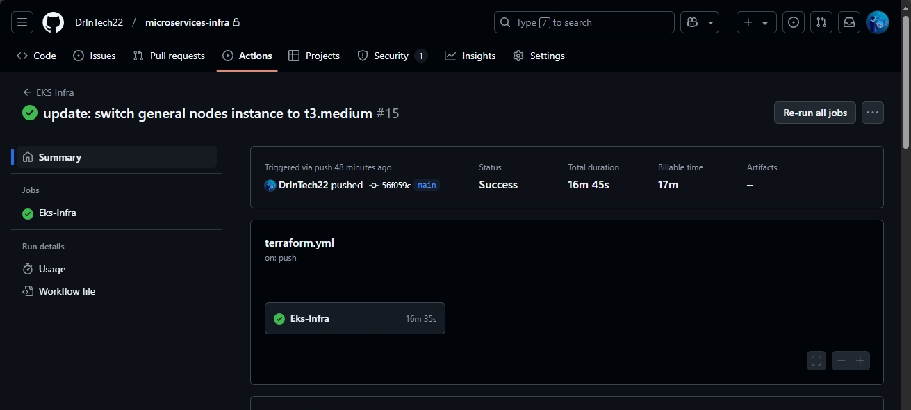</img> 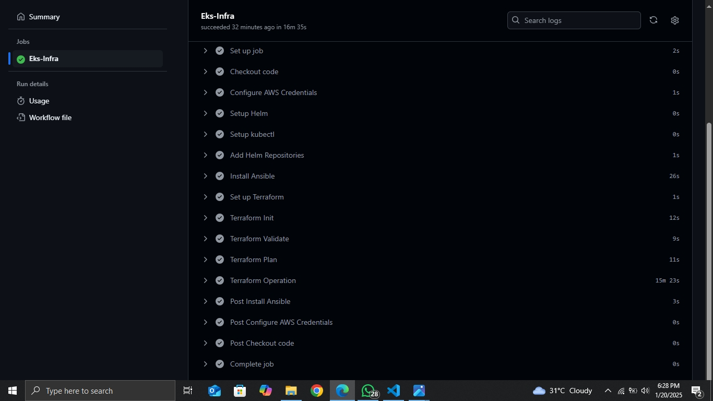</img> 
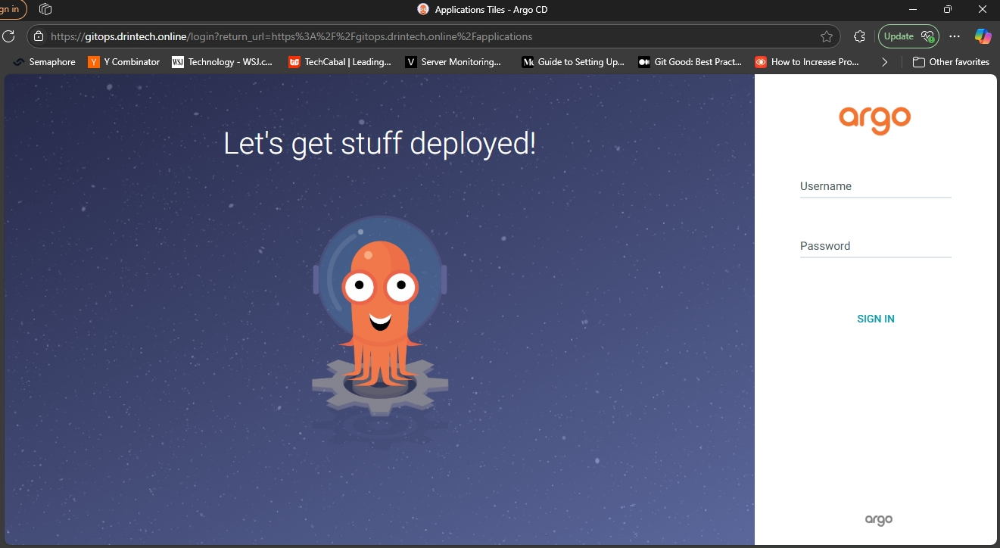</img> 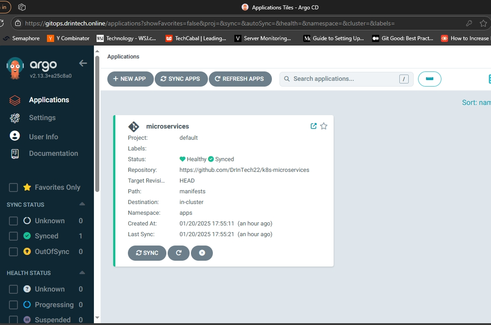</img> 
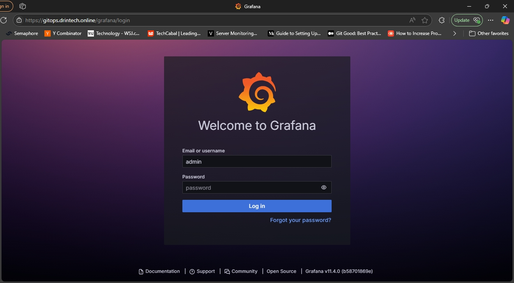</img> 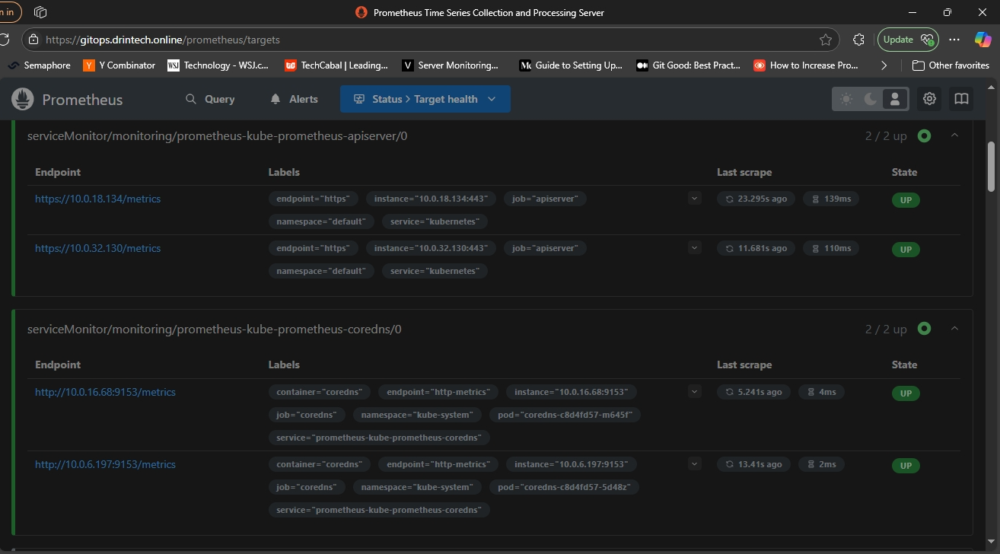</img> 

## Application Repository
This repository contains the microservices source code, Dockerfiles, and CI pipelines.

### Repository Structure
```
microservices-gitops/
├── .github/
│   ├── workflows/
│   │   ├── ci-adservice.yml
│   │   ├── ci-cartservice.yml
│   │   ├── ci-checkoutservice.yml
│   │   ├── ci-currencyservice.yml
│   │   ├── ci-emailservice.yml
│   │   ├── ci-frontend.yml
│   │   ├── ci-loadgenerator.yml
│   │   ├── ci-paymentservice.yml
│   │   ├── ci-productcatalogservice.yml
│   │   ├── ci-recommendationservice.yml
│   │   ├── ci-shippingservice.yml
│   │   └── ci-shoppingassistantservice.yml
│
├── src/
│   ├── adservice/
│   │   ├── Dockerfile
│   │   └── other configurations...
│   ├── cartservice/
│   │   ├── Dockerfile
│   │   └── other configurations...
│   ├── checkoutservice/
│   │   ├── Dockerfile
│   │   └── other configurations...
│   ├── currencyservice/
│   │   ├── Dockerfile
│   │   └── other configurations...
│   ├── emailservice/
│   │   ├── Dockerfile
│   │   └── other configurations...
│   ├── frontend/
│   │   ├── Dockerfile
│   │   └── other configurations...
│   ├── loadgenerator/
│   │   ├── Dockerfile
│   │   └── other configurations...
│   ├── paymentservice/
│   │   ├── Dockerfile
│   │   └── other configurations...
│   ├── productcatalogservice/
│   │   ├── Dockerfile
│   │   └── other configurations...
│   ├── recommendationservice/
│   │   ├── Dockerfile
│   │   └── other configurations...
│   ├── shippingservice/
│   │   ├── Dockerfile
│   │   └── other configurations...
│   └── shoppingassistantservice/
│       ├── Dockerfile
│       └── other configurations...
│
├── README.md
```

### CI pipelines
Each microservice has its own pipeline that is triggered when changes from their respective `src/` folder are pushed to the repository. The `src/` includes a Dockerfile used to package each microservice.

Each workflow comprises two jobs:
- `Service-CI`: This builds the docker image, scans it, uploads the result to Github security tab, and pushes the image to Docker Hub. 
- `Update-Manifest-Repo`: This clones the `manifest repo`, creates a release branch, and update the corresponding manifest with the latest image tag. It then creates a pull request from the `release` branch to the `main` branch. After a successful review and merge, the `release` branch is automatically deleted. ArgoCD automatically syncs the microservices deployment in the cluster with the latest image tag.

Every pipeline execution tags the docker image with two tags:
- `IMAGE_TAG_1`: This tags the docker image with the tag `latest`. This ensures that we can pull the latest docker image of any microservice in a test environment easily.
- `IMAGE_TAG_2`: This image tag includes the workflow number and short COMMIT-SHA (e.g `cymbal-frontend:6-7df2473`) to ensure tracebility during unexpected events or debugging. 

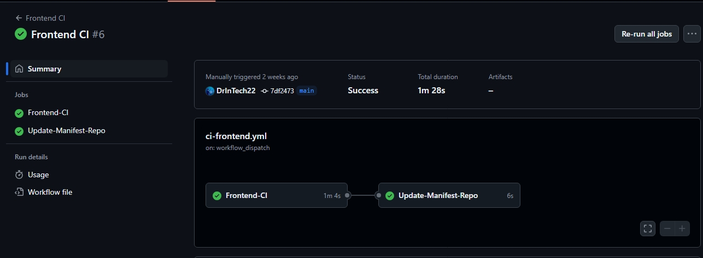</img> 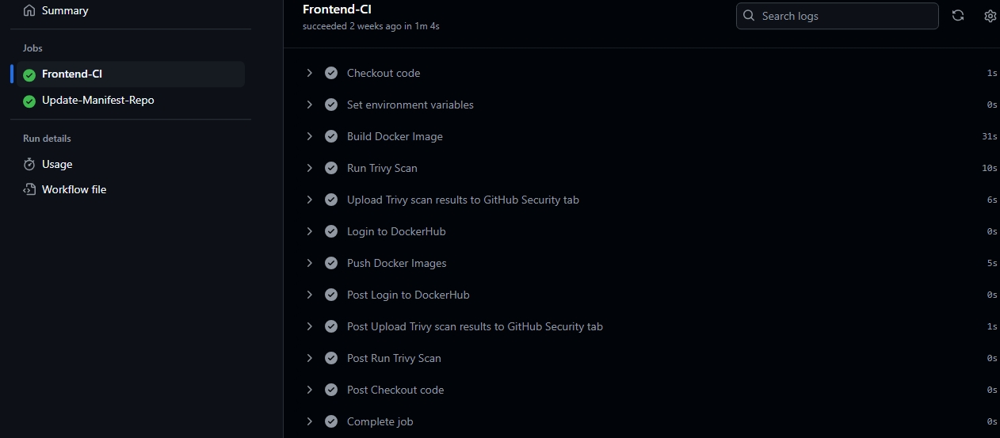</img> 
`ci-adservice.yml`
```yml
name: Adservice CI 

on:
  push:
    branches: [ main ]
    paths:
      - 'src/adservice/**'
  workflow_dispatch:

permissions:
  security-events: write

env:
  DOCKERHUB_ID: maestrops
  MANIFEST_REPO: DrInTech22/k8s-microservices

jobs: 
  Adservice-CI:
    runs-on: ubuntu-latest

    outputs:
      image_tag: ${{ steps.tag.outputs.IMAGE_TAG_2 }}

    steps:
      - name: Checkout code
        uses: actions/checkout@v4

      - name: Set environment variables
        id: tag
        run: |
          COMMIT_SHA=$(git rev-parse --short HEAD)
          echo "APP_NAME=adservice" >> $GITHUB_ENV
          echo "IMAGE_NAME=${{ env.DOCKERHUB_ID }}/adservice" >> $GITHUB_ENV
          echo "IMAGE_TAG_1=latest" >> $GITHUB_ENV
          IMAGE_TAG_2="${{ github.run_number }}-$COMMIT_SHA"
          echo "IMAGE_TAG_2=${IMAGE_TAG_2}" >> $GITHUB_ENV
          echo "IMAGE_TAG_2=${IMAGE_TAG_2}" >> $GITHUB_OUTPUT

      - name: Build Docker Image
        working-directory: src/adservice
        run: |
          docker build -t ${{ env.IMAGE_NAME }} .
          docker tag ${{ env.IMAGE_NAME }} ${{ env.IMAGE_NAME }}:${{ env.IMAGE_TAG_2 }}

      - name: Run Trivy Scan
        uses: aquasecurity/trivy-action@master
        with:
          image-ref: ${{ env.IMAGE_NAME }}
          format: 'sarif'
          output: '${{ env.APP_NAME }}.sarif'

      - name: Upload Trivy scan results to GitHub Security tab
        uses: github/codeql-action/upload-sarif@v3
        with:
          sarif_file: '${{ env.APP_NAME }}.sarif'

      - name: Login to DockerHub
        uses: docker/login-action@v2
        with:
          username: ${{ env.DOCKERHUB_ID }}
          password: ${{ secrets.DOCKERHUB_TOKEN }}

      - name: Push Docker Images
        run: |
          docker push ${{ env.IMAGE_NAME }}:${{ env.IMAGE_TAG_1 }}
          docker push ${{ env.IMAGE_NAME }}:${{ env.IMAGE_TAG_2 }}

  Update-Manifest-Repo:
    needs: Adservice-CI
    runs-on: ubuntu-latest

    env:
      APP_NAME: adservice
      IMAGE_TAG: ${{ needs.Adservice-CI.outputs.image_tag }}
      
    steps:
      - name: Checkout Manifest Repository
        uses: actions/checkout@v4
        with:
          repository: ${{ env.MANIFEST_REPO }}
          token: ${{ secrets.TOKEN }}

      - name: Update Manifest File
        run: |
          cd manifests
          sed -i "s|image:.*|image: ${{ env.DOCKERHUB_ID }}/${{ env.APP_NAME }}:${{ env.IMAGE_TAG }}|" ${{ env.APP_NAME }}.yml

      - name: Create Pull Request
        uses: peter-evans/create-pull-request@v5
        with:
          token: ${{ secrets.TOKEN }}
          commit-message: "Update ${{ env.APP_NAME }} image to ${{ env.DOCKERHUB_ID }}/${{ env.APP_NAME }}:${{ env.IMAGE_TAG }}"
          branch: release/${{ env.APP_NAME }}-update-${{ env.IMAGE_TAG }}
          title: "Update ${{ env.APP_NAME }} image to ${{ env.DOCKERHUB_ID }}/${{ env.APP_NAME }}:${{ env.IMAGE_TAG }}"
          body: |
            This pull request updates the ${{ env.APP_NAME }} image tag to `${{ env.DOCKERHUB_ID }}/${{ env.APP_NAME }}:${{ env.IMAGE_TAG }}`.
            Please review and merge to deploy the updated image to the cluster.
          base: main
```

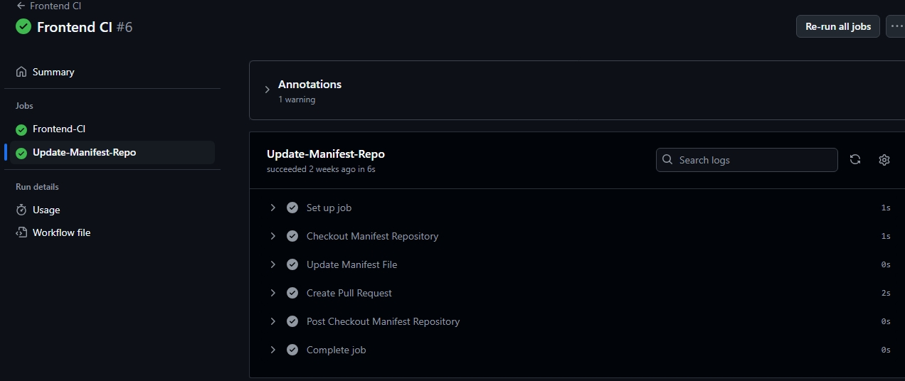</img> 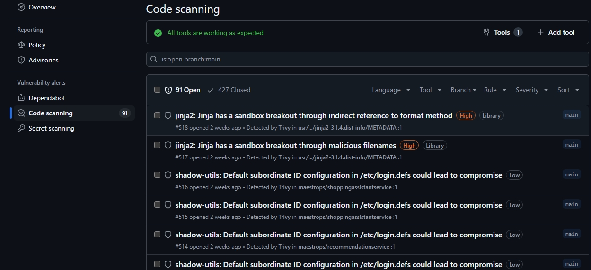</img> 

## Manifests Repository
Ths comprises the kubernetes manifests for each microservices. Each manifests includes a deployment and svc configurations except for the frontend manifest which additionally includes ingress configuration for TLS and frontend access via a custom domain.

After a successful review and merge of the PR from the `release` branch, ArgoCD automatically deploys the latest changes to `apps` namespace on the cluster. The `release` branch is automatically deleted. 

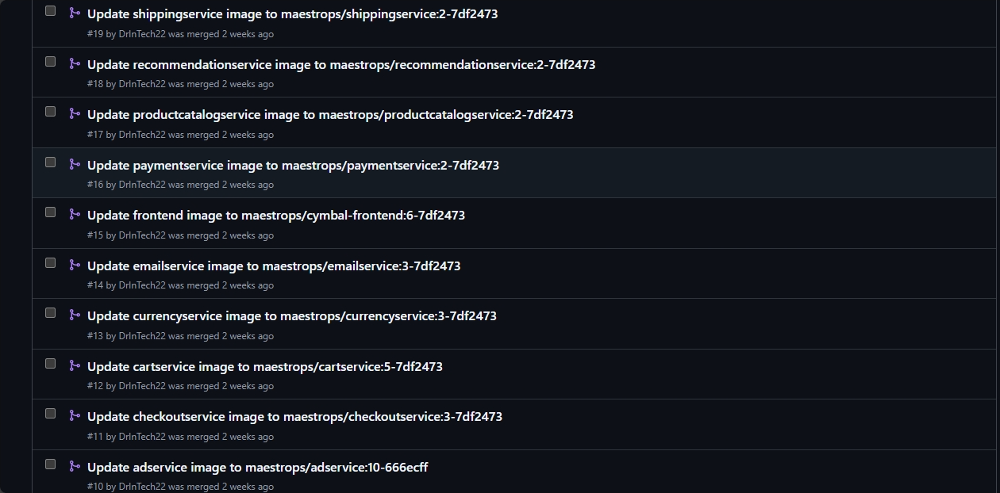</img> 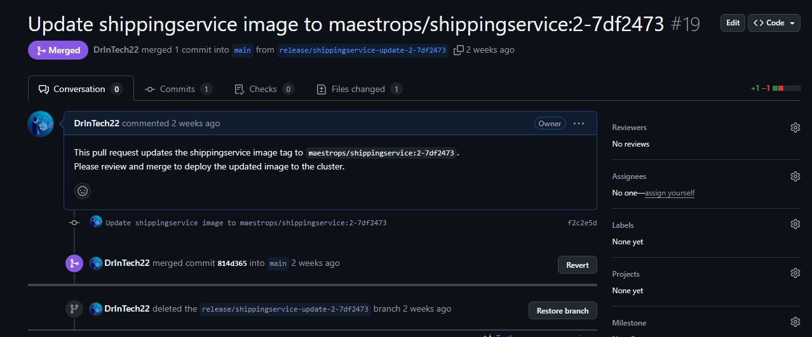</img> 

`frontend.yml`
```yml
apiVersion: apps/v1
kind: Deployment
metadata:
  name: frontend
spec:
  selector:
    matchLabels:
      app: frontend
  template:
    metadata:
      labels:
        app: frontend
    spec:
      containers:
        - name: server
          image: maestrops/cymbal-frontend:6-7df2473
          ports:
          - containerPort: 8080
          readinessProbe:
            initialDelaySeconds: 10
            httpGet:
              path: "/_healthz"
              port: 8080
              httpHeaders:
              - name: "Cookie"
                value: "shop_session-id=x-readiness-probe"
          livenessProbe:
            initialDelaySeconds: 10
            httpGet:
              path: "/_healthz"
              port: 8080
              httpHeaders:
              - name: "Cookie"
                value: "shop_session-id=x-liveness-probe"
          env:
          - name: PORT
            value: "8080"
          - name: PRODUCT_CATALOG_SERVICE_ADDR
            value: "productcatalogservice:3550"
          - name: CURRENCY_SERVICE_ADDR
            value: "currencyservice:7000"
          - name: CART_SERVICE_ADDR
            value: "cartservice:7070"
          - name: RECOMMENDATION_SERVICE_ADDR
            value: "recommendationservice:8080"
          - name: SHIPPING_SERVICE_ADDR
            value: "shippingservice:50051"
          - name: SHOPPING_ASSISTANT_SERVICE_ADDR
            value: "shoppingassistantservice:80"
          - name: CHECKOUT_SERVICE_ADDR
            value: "checkoutservice:5050"
          - name: AD_SERVICE_ADDR
            value: "adservice:9555"
          - name: ENV_PLATFORM
            value: "aws"
          - name: ENABLE_PROFILER
            value: "0"
          - name: FRONTEND_MESSAGE
            value: "DrInTech Has Successfully Deployed on EKS Cluster"
          resources:
            requests:
              cpu: 100m
              memory: 64Mi
            limits:
              cpu: 200m
              memory: 128Mi
---
apiVersion: v1
kind: Service
metadata:
  name: frontend
spec:
  type: ClusterIP
  selector:
    app: frontend
  ports:
  - name: http
    port: 80
    targetPort: 8080
---
apiVersion: networking.k8s.io/v1
kind: Ingress
metadata:
  name: frontend-ingress
  annotations:
    nginx.ingress.kubernetes.io/force-ssl-redirect: "true"
    nginx.ingress.kubernetes.io/ssl-passthrough: "true"
    cert-manager.io/cluster-issuer: "http01-prod"
spec:
  ingressClassName: nginx
  rules:
  - host: boutique.drintech.online
    http:
      paths:
      - path: /
        pathType: ImplementationSpecific
        backend:
          service:
            name: frontend
            port:
              number: 80
  tls:
  - hosts:
      - boutique.drintech.online
    secretName: boutique-drintech-online
```

`cartservice.yml`
```yml
apiVersion: apps/v1
kind: Deployment
metadata:
  name: cartservice
spec:
  selector:
    matchLabels:
      app: cartservice
  template:
    metadata:
      labels:
        app: cartservice
    spec:
      containers:
      - name: server
        image: maestrops/cartservice:5-7df2473
        ports:
        - containerPort: 7070
        env:
        - name: REDIS_ADDR
          value: "redis-cart:6379"
        resources:
          requests:
            cpu: 200m
            memory: 64Mi
          limits:
            cpu: 300m
            memory: 128Mi
        readinessProbe:
          initialDelaySeconds: 15
          grpc:
            port: 7070
        livenessProbe:
          initialDelaySeconds: 15
          periodSeconds: 10
          grpc:
            port: 7070
---
apiVersion: v1
kind: Service
metadata:
  name: cartservice
spec:
  type: ClusterIP
  selector:
    app: cartservice
  ports:
  - name: grpc
    port: 7070
    targetPort: 7070
```
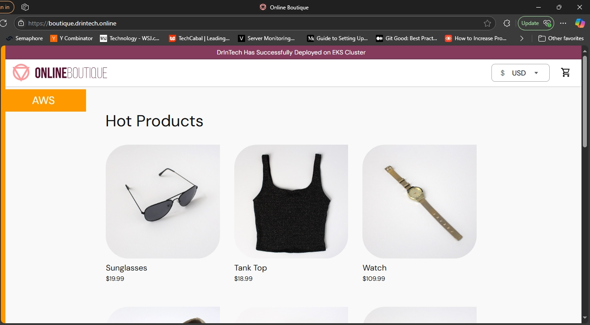</img> </img> 
</img> </img>


